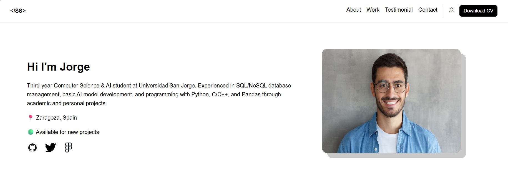
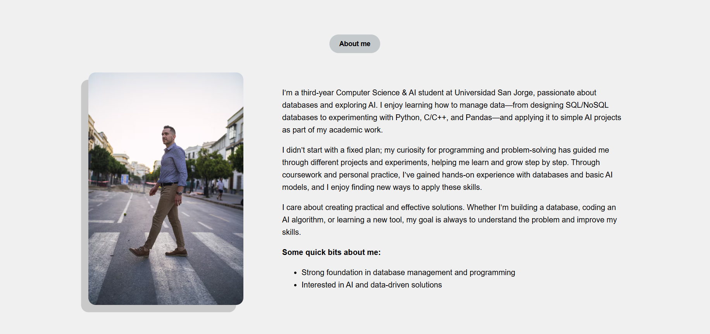
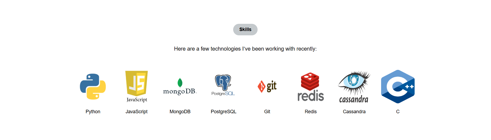
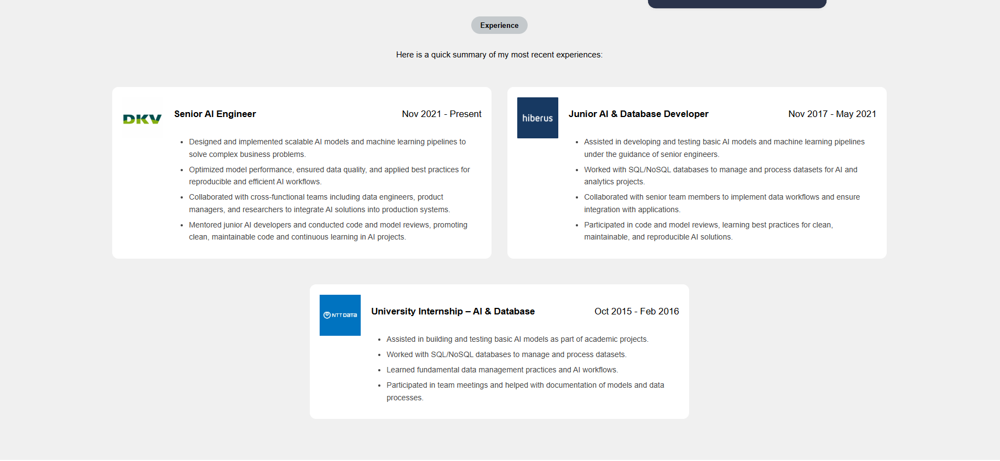
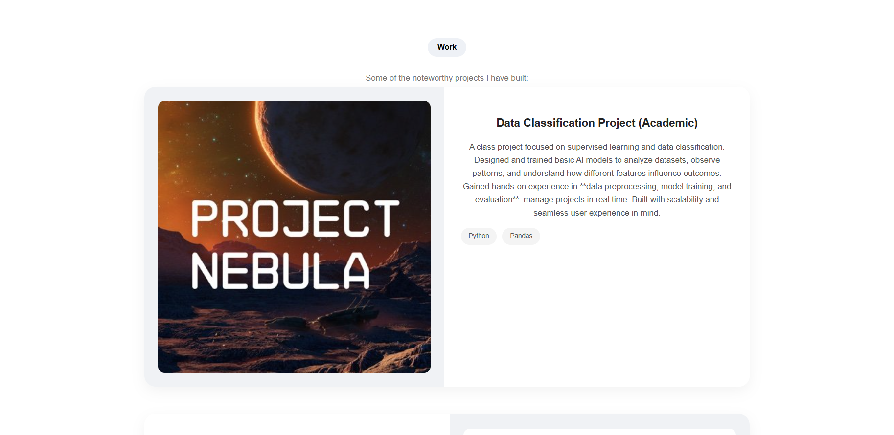
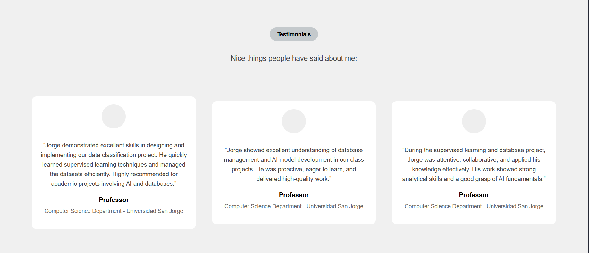
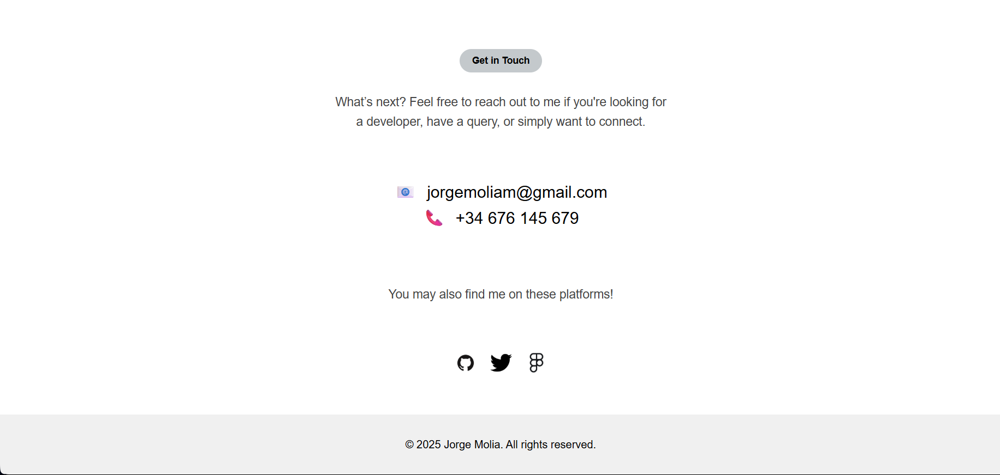

# Personal-portfolio-Jorge-Molia

Este proyecto es un **portafolio personal** desarrollado como práctica en la asignatura de Sistemas Web.  
La tarea consistía en **replicar un diseño de currículum ya existente** obtenido de Figma, añadiendo nuestros propios datos y adaptando el contenido a nuestra información personal y profesional donde pudieramos y en otras zonas infromacion inventada.

El sitio web es **estático** y está organizado en secciones principales:

- **Información personal**: presentación breve, contacto y redes sociales.
- **Habilidades**: herramientas y competencias técnicas.
- **Experiencia laboral**: trabajos anteriores y responsabilidades desempeñadas.
- **Proyectos realizados**: ejemplos de trabajos o proyectos destacados.
- **Testimonios**: opiniones de personas relacionadas con la experiencia profesional.

Además, se ha realizado un **diseño responsivo**, que permite visualizar correctamente el portafolio en **dispositivos móviles y desktops**, adaptando la disposición de los elementos según el tamaño de pantalla.

## Capturas del proyecto

Aquí puedes ir insertando capturas de pantalla del `index.html` y secciones principales del portafolio.

### Página de inicio

### Sección "About Me"

### Sección "Skills"

### Sección "Experience"

### Sección "Work"

### Sección "Testimonial"

### Sección "Contact"

## Repositorio en GitHub
[Personal Portfolio - GitHub](https://github.com/JMM284/Personal-portfolio-static-website-sistemas-web-)

## Despliegue en Firebase

El proyecto tambien esta **desplegado en Firebase**, lo que permite acceder al portafolio a traves de un enlace.  

- **Enlace al sitio en Firebase**: [https://jmm284-f90de.web.app](https://jmm284-f90de.web.app)  

Esto permite que cualquier persona pueda visualizar el portafolio sin necesidad de descargar el código. 

## Bibliografía

- **Referencia para el diseño del curriculum:**  
[Figma - Personal Portfolio Website Template](https://www.figma.com/design/kD5QhjtnLWNSAGu3L87CFI/Personal-Portfolio-Website-Template-%7C-Mobile---Desktop--Community-?node-id=0-1&p=f&t=0hPzrwwER3LBkVRm-0) – Plantilla usada como referencia para el diseño del curriculum.

- **Diseño responsive para móvil:**  
[FreeCodeCamp - Media Queries para móvil](https://www.freecodecamp.org/espanol/news/ejemplo-css-media-query-ancho-de-pantalla-max-y-min-para-diseno-adaptable-en-movil) – Cómo adaptar el diseño a diferentes tamaños de pantalla.

- **Cómo funcionan los Flex y los Grid:**  
[CSS-Tricks - Funcionamiento de Grids y Flex](https://css-tricks.com/snippets/css/a-guide-to-flexbox) – Guía para saber como funciona los distintos tipos de fles y el grid,

- **Sombras y bordes en CSS:**  
[MDN - Box-shadow](https://developer.mozilla.org/es/docs/Web/CSS/box-shadow) – Aprender a crear sombras y bordes en css.

